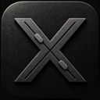

# Gallager

Monitor and drive your coding-agent sessions — **Claude Code**, **Codex CLI**, **opencode**, and **pi** — from a Mac menu-bar app, with an iOS companion that works from anywhere over an end-to-end-encrypted relay.

**Website & downloads: [gallager.app](https://gallager.app)**

## What it does

- **Live tmux mirroring** — every agent session runs in a tmux pane that Gallager mirrors in real time, on your Mac and on your iPhone.
- **Session awareness** — knows when an agent is working, finished, or waiting on you (permission prompts, questions, plan approvals) and raises badges and notifications instead of making you poll terminals.
- **Remote control** — answer permission prompts, reply to questions, send keystrokes, and start new sessions from the iOS app.
- **Workbench** — file browser, git status, and an in-app prompt editor (Ctrl-G from the terminal) around each session.
- **Token/cost meter** — per-session token, cost, and latency tracking via OTLP telemetry.
- **End-to-end encrypted** — the relay only routes ciphertext; it can't read your terminals. Self-host it or use the hosted one.

Anything that runs in tmux can be mirrored and streamed as a plain terminal; agents beyond the built-in ones are supported through [sidecar plugins](docs/plugins/sidecar-authoring.md) (see [`plugins/opencode`](plugins/opencode) and [`plugins/pi`](plugins/pi) for complete examples).

## Components

| Component | Description | Source |
|---|---|---|
| Mac app | tmux pane mirroring, agent hooks, workbench UI | `ClaudeSpyPackage/Sources/ClaudeSpyServerFeature` |
| Relay server | Vapor app (Docker/Linux): device pairing, WebSocket routing, E2EE passthrough | `ClaudeSpyPackage/Sources/ClaudeSpyExternalServer` |
| iOS app | Remote monitoring and command dispatch | `ClaudeSpyPackage/Sources/ClaudeSpyFeature` |

> Internal target and module names predate the rename to Gallager and still say "ClaudeSpy" — same project.

## Install

- **Mac app** — download from [gallager.app](https://gallager.app); updates arrive via Sparkle.
- **iOS app** — [TestFlight](https://testflight.apple.com/join/yFQnxgDv).

## Build from source

Requires a recent Xcode (Swift 6.3+ toolchain), macOS 15+, and tmux.

- **Mac app** — open `ClaudeSpy.xcworkspace`, build the `ClaudeSpyServer` scheme.
- **iOS app** — same workspace, `ClaudeSpy` scheme (iOS 17+).
- **Relay server** —
  ```sh
  cd ClaudeSpyPackage
  cp .env.example .env
  docker compose up -d
  ```
- **Tests** — `swift test` in `ClaudeSpyPackage`; end-to-end suite via `./scripts/e2e-test.sh` (see [docs/e2e-testing.md](docs/e2e-testing.md)).

Local installable packages must be built from the primary worktree. Run
`./scripts/package-local-macos.sh` for the signed DMG. For a personal-device
iOS IPA, copy `Config/Local.xcconfig.example` to the ignored
`Config/Local.xcconfig`, set your development team and bundle ID, then run
`./scripts/package-local-ios.sh`. Both scripts keep Xcode and SwiftPM caches in
`.build-local/`, write artifacts to `dist/`, and embed a visible UTC build stamp
and Git revision in the app's About UI.

Tip: the repo carries e2e screenshot baselines, so a blobless clone is much faster: `git clone --filter=blob:none https://github.com/gpambrozio/Gallager.git`

## Self-hosting

The relay is free to self-host — one lightweight Vapor server behind any TLS reverse proxy, no license keys. See [docs/self-hosting.md](docs/self-hosting.md). Prefer not to run a server? There's a [hosted relay](https://gallager.app/pricing/) with a paid subscription.

## Documentation

- [Architecture (Mac app)](docs/architecture.md) and [distributed architecture](docs/distributed-architecture-plan.md)
- [End-to-end encryption design](docs/e2ee-encryption-plan.md)
- [Sidecar plugin authoring](docs/plugins/sidecar-authoring.md)
- [E2E testing](docs/e2e-testing.md)

## License

[AGPL-3.0](LICENSE). The apps and relay are open source; run them, audit them, fork them — if you offer a modified relay as a network service, share your changes.
